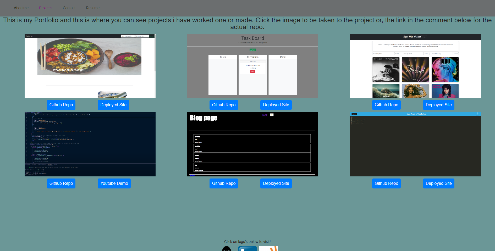

# Better-portfolio-repo

## Description

This repo is my professional portfolio. The Link i can attach to job hirings when applying and show what i know using react and vite.
With this i show my Projects and the things i have been taught over this three month course.

## Screenshot

You can see the grid layout and how portfolio is retaining its color due to being the active tab. There are buttons taking you to the repo or the deployed site and if never posted it takes you to a youtube demonstration

## Collaboration

I was able to finish this due too the help of my tutor Juan, and Instructor Ben

## Links

Here is the link to the deployed site
https://shimmering-jelly-6541a0.netlify.app/
